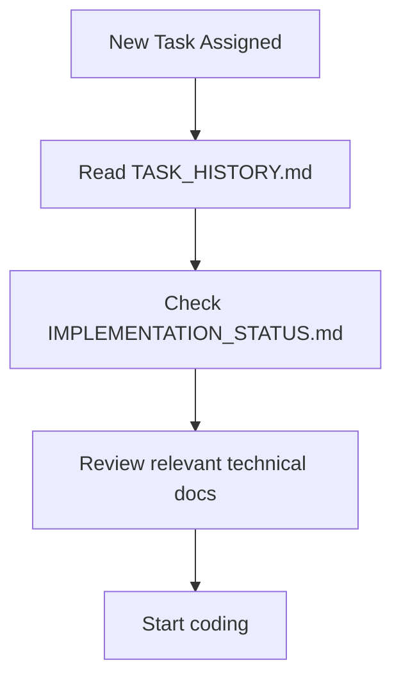
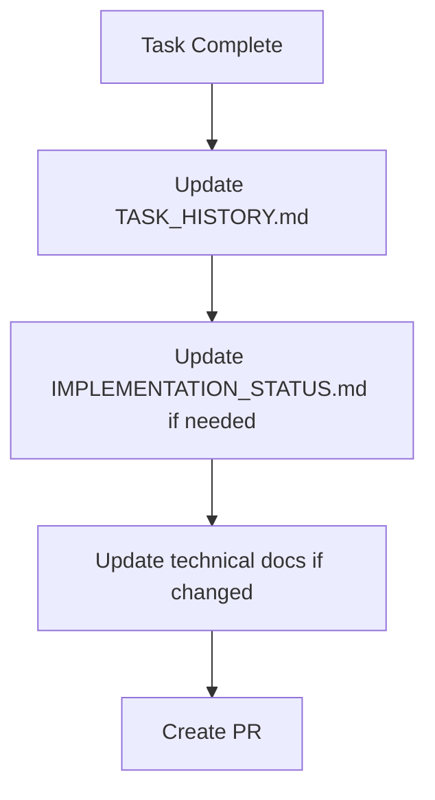
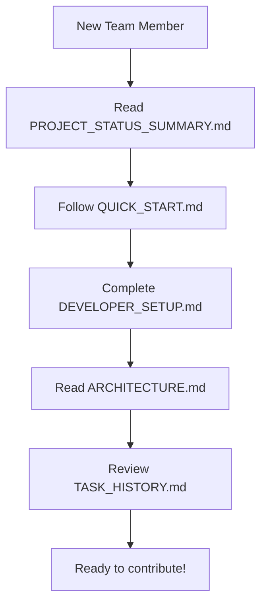

# TSmart Warehouse - Documentation Map

**Visual guide to all documentation and how they relate to each other**

---

## 📊 Documentation Hierarchy

```
┌─────────────────────────────────────────────────────────────────┐
│                     START HERE                                   │
│                                                                  │
│  📄 PROJECT_STATUS_SUMMARY.md                                   │
│  Quick overview of project status, progress, and metrics        │
│  ⏱️ Read time: 5 minutes                                        │
└─────────────────────────────────────────────────────────────────┘
                              │
                              ├──────────────┬──────────────┐
                              ▼              ▼              ▼
┌──────────────────────┐  ┌──────────────────────┐  ┌──────────────────────┐
│  For New Developers  │  │  For Contributors    │  │  For Project Mgmt    │
└──────────────────────┘  └──────────────────────┘  └──────────────────────┘
           │                        │                         │
           │                        │                         │
           ▼                        ▼                         ▼
┌──────────────────────┐  ┌──────────────────────┐  ┌──────────────────────┐
│ QUICK_START.md       │  │ TASK_HISTORY.md      │  │ IMPLEMENTATION_      │
│ Get up & running     │  │ Previous work log    │  │ STATUS.md            │
│ ⏱️ 10 minutes        │  │ ⏱️ 5-15 minutes      │  │ Complete status      │
└──────────────────────┘  └──────────────────────┘  │ ⏱️ 30 minutes        │
           │                        │                 └──────────────────────┘
           ▼                        ▼
┌──────────────────────┐  ┌──────────────────────┐
│ DEVELOPER_SETUP.md   │  │ ARCHITECTURE.md      │
│ Complete setup       │  │ System design        │
│ ⏱️ 30 minutes        │  │ ⏱️ 20 minutes        │
└──────────────────────┘  └──────────────────────┘
           │                        │
           └────────────┬───────────┘
                        ▼
           ┌────────────────────────┐
           │   Technical Docs       │
           └────────────────────────┘
```

---

## 🎯 Documentation by Purpose

### 1️⃣ Getting Started (First Day)

```
Start → PROJECT_STATUS_SUMMARY.md (5 min)
     → QUICK_START.md (10 min)
     → DEVELOPER_SETUP.md (30 min)
     → Start coding! 🚀
```

**Purpose**: Get a new developer productive on day one

**Documents**:
- `PROJECT_STATUS_SUMMARY.md` - What's the project about?
- `QUICK_START.md` - How do I start?
- `DEVELOPER_SETUP.md` - How do I set up my environment?

---

### 2️⃣ Understanding the System (First Week)

```
ARCHITECTURE.md
     ├─→ DATABASE_SCHEMA.md
     ├─→ API_DOCUMENTATION.md
     └─→ MIGRATION_GUIDE.md
```

**Purpose**: Understand how the system works

**Documents**:
- `ARCHITECTURE.md` - System design and patterns
- `DATABASE_SCHEMA.md` - Database structure
- `API_DOCUMENTATION.md` - API endpoints
- `MIGRATION_GUIDE.md` - How we're modernizing
- `MODERNIZATION_SUMMARY.md` - What changed and why

---

### 3️⃣ Working on Features (Daily)

```
Before Starting:
  → TASK_HISTORY.md (Check previous work)
  → IMPLEMENTATION_STATUS.md (Check current status)

While Working:
  → ARCHITECTURE.md (Follow patterns)
  → DATABASE_SCHEMA.md (Database reference)
  → API_DOCUMENTATION.md (API reference)

After Completing:
  → TASK_HISTORY.md (Log your work)
```

**Purpose**: Context and reference for daily work

**Documents**:
- `TASK_HISTORY.md` - What's been done, what's next
- `IMPLEMENTATION_STATUS.md` - Current state of everything
- Technical references as needed

---

### 4️⃣ Deploying (Release Time)

```
DEPLOYMENT_GUIDE.md
     ├─→ Environment setup
     ├─→ Database migrations
     ├─→ Vercel configuration
     └─→ Post-deployment checks
```

**Purpose**: Deploy to production safely

**Documents**:
- `DEPLOYMENT_GUIDE.md` - Complete deployment process

---

### 5️⃣ Troubleshooting (When Issues Arise)

```
Issue Type:
  ├─→ Database? → DATABASE_URL_FIX.md
  ├─→ Auth? → DEBUG_PASSWORD_RESET.md
  ├─→ Performance? → PERFORMANCE_OPTIMIZATION.md
  └─→ General? → DEVELOPER_SETUP.md (Troubleshooting)
```

**Purpose**: Fix common issues quickly

**Documents**:
- `DATABASE_URL_FIX.md`
- `DEBUG_PASSWORD_RESET.md`
- `FIND_CONNECTION_STRING.md`
- `FIX_DATABASE_URL.md`
- `GET_DATABASE_URL.md`
- `SUPABASE_EMAIL_TEMPLATE.md`
- `PERFORMANCE_OPTIMIZATION.md`

---

## 📚 Complete Document Index

### 🎯 Status & Planning

| Document | Purpose | Read Time | Update Frequency |
|----------|---------|-----------|------------------|
| `PROJECT_STATUS_SUMMARY.md` | Quick status overview | 5 min | Weekly |
| `IMPLEMENTATION_STATUS.md` | Detailed status tracking | 30 min | Bi-weekly |
| `TASK_HISTORY.md` | Task log and history | 5-15 min | After each task |

### 🏗️ Architecture & Design

| Document | Purpose | Read Time | Update Frequency |
|----------|---------|-----------|------------------|
| `ARCHITECTURE.md` | System architecture | 20 min | When architecture changes |
| `MODERNIZATION_SUMMARY.md` | Modernization changes | 15 min | When patterns change |
| `MIGRATION_GUIDE.md` | Migration patterns | 15 min | When patterns change |

### 🚀 Getting Started

| Document | Purpose | Read Time | Update Frequency |
|----------|---------|-----------|------------------|
| `QUICK_START.md` | Quick start guide | 10 min | When setup changes |
| `DEVELOPER_SETUP.md` | Complete setup guide | 30 min | When setup changes |
| `DEPLOYMENT_GUIDE.md` | Deployment guide | 20 min | When deployment changes |

### 📖 Technical Reference

| Document | Purpose | Read Time | Update Frequency |
|----------|---------|-----------|------------------|
| `API_DOCUMENTATION.md` | API reference | 30 min | When APIs change |
| `DATABASE_SCHEMA.md` | Database structure | 25 min | When schema changes |
| `API_CLIENT_MIGRATION.md` | API migration guide | 10 min | When migration patterns change |

### 🔧 Troubleshooting

| Document | Purpose | Read Time | Update Frequency |
|----------|---------|-----------|------------------|
| `DATABASE_URL_FIX.md` | Database connection issues | 5 min | As needed |
| `DEBUG_PASSWORD_RESET.md` | Password reset debugging | 5 min | As needed |
| `FIND_CONNECTION_STRING.md` | Finding DB credentials | 5 min | As needed |
| `FIX_DATABASE_URL.md` | Database URL fixes | 5 min | As needed |
| `GET_DATABASE_URL.md` | Getting database URL | 5 min | As needed |
| `SUPABASE_EMAIL_TEMPLATE.md` | Email template setup | 10 min | As needed |
| `PERFORMANCE_OPTIMIZATION.md` | Performance guide | 15 min | As needed |

### 👥 User Documentation

| Document | Purpose | Read Time | Update Frequency |
|----------|---------|-----------|------------------|
| `USER_DOCUMENTATION.md` | End-user guide | 20 min | When features change |

---

## 🎭 Documentation by Role

### 👨‍💻 Software Developer

**Essential Reading**:
1. `PROJECT_STATUS_SUMMARY.md` - Understand the project
2. `QUICK_START.md` - Get started quickly
3. `DEVELOPER_SETUP.md` - Set up environment
4. `ARCHITECTURE.md` - Understand the system
5. `TASK_HISTORY.md` - Check before starting work

**Reference Documents**:
- `DATABASE_SCHEMA.md` - When working with database
- `API_DOCUMENTATION.md` - When working with APIs
- `MIGRATION_GUIDE.md` - When migrating code

**Daily Use**:
- `TASK_HISTORY.md` - Log work
- `IMPLEMENTATION_STATUS.md` - Check status

---

### 👨‍💼 Project Manager

**Essential Reading**:
1. `PROJECT_STATUS_SUMMARY.md` - Quick overview
2. `IMPLEMENTATION_STATUS.md` - Detailed status
3. `TASK_HISTORY.md` - Progress tracking

**Reference Documents**:
- `ARCHITECTURE.md` - Technical decisions
- `DEPLOYMENT_GUIDE.md` - Release process

**Weekly Review**:
- `PROJECT_STATUS_SUMMARY.md` - Status updates
- `TASK_HISTORY.md` - Progress review

---

### 🎨 UI/UX Designer

**Essential Reading**:
1. `PROJECT_STATUS_SUMMARY.md` - Project overview
2. `ARCHITECTURE.md` - Design system section
3. `USER_DOCUMENTATION.md` - User flows

**Reference Documents**:
- `IMPLEMENTATION_STATUS.md` - UI/UX section
- Component documentation (in code)

---

### 🧪 QA Engineer

**Essential Reading**:
1. `PROJECT_STATUS_SUMMARY.md` - What to test
2. `USER_DOCUMENTATION.md` - Expected behavior
3. `API_DOCUMENTATION.md` - API testing

**Reference Documents**:
- `IMPLEMENTATION_STATUS.md` - Testing section
- `DATABASE_SCHEMA.md` - Data validation

---

### 🚀 DevOps Engineer

**Essential Reading**:
1. `DEPLOYMENT_GUIDE.md` - Deployment process
2. `ARCHITECTURE.md` - Infrastructure
3. `PERFORMANCE_OPTIMIZATION.md` - Optimization

**Reference Documents**:
- `DATABASE_SCHEMA.md` - Database setup
- Troubleshooting guides - Common issues

---

## 🔄 Documentation Workflow

### When Starting a New Task



### When Completing a Task



### When Onboarding



---

## 📊 Documentation Metrics

### Coverage

- **Status Documentation**: ✅ 100% (3/3 documents)
- **Architecture Documentation**: ✅ 100% (3/3 documents)
- **Setup Documentation**: ✅ 100% (3/3 documents)
- **Technical Reference**: ✅ 100% (3/3 documents)
- **Troubleshooting**: ✅ 100% (7/7 documents)
- **User Documentation**: 🔄 50% (1/2 documents)

### Freshness

- **Last Major Update**: December 25, 2025
- **Documents Updated**: 15
- **New Documents Created**: 4
- **Outdated Documents**: 0

### Quality

- **Completeness**: 95%
- **Clarity**: High
- **Examples**: Abundant
- **Cross-references**: Comprehensive

---

## 🎯 Documentation Principles

### 1. Single Source of Truth
Each piece of information should exist in exactly one place.

### 2. Progressive Disclosure
Start with simple overviews, link to detailed docs.

### 3. Task-Oriented
Organize by what users need to do, not by system structure.

### 4. Always Current
Update docs when code changes, not later.

### 5. Examples First
Show examples before explaining theory.

### 6. Cross-Reference
Link related documents liberally.

---

## 🔗 Quick Links by Task

### "I'm new here"
→ `PROJECT_STATUS_SUMMARY.md`

### "I need to set up my environment"
→ `DEVELOPER_SETUP.md`

### "I'm starting a new feature"
→ `TASK_HISTORY.md` → `ARCHITECTURE.md`

### "I need to understand the database"
→ `DATABASE_SCHEMA.md`

### "I need to call an API"
→ `API_DOCUMENTATION.md`

### "I need to deploy"
→ `DEPLOYMENT_GUIDE.md`

### "Something's broken"
→ Troubleshooting guides

### "I need to know project status"
→ `IMPLEMENTATION_STATUS.md`

---

## 📝 Maintaining This Map

**Update this map when**:
- Adding new documentation
- Changing documentation structure
- Reorganizing documents
- Changing workflows

**Review frequency**: Monthly

**Owner**: Development Team

---

**Last Updated**: December 25, 2025  
**Next Review**: January 25, 2026  
**Maintained By**: TSmart Development Team

